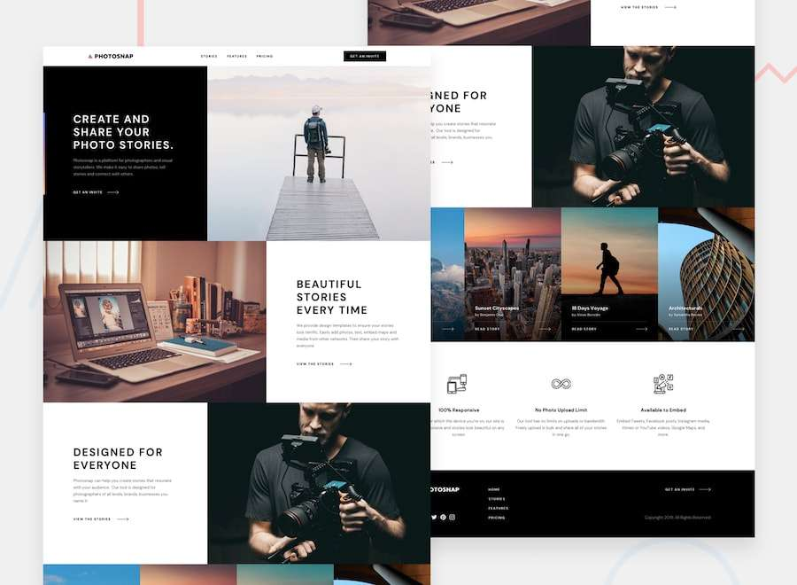

# Collaborative Project Group - 008 || photosnap-multi-page-website

This is a solution to the [photosnap-multi-page-website ](https://www.frontendmentor.io/challenges/interactive-rating-component-koxpeBUmI). Frontend Mentor challenges help you improve your coding skills by building realistic projects.

## Contributors

- Levan Iakobidze.
- Tata Kharkhelauri.
- Ia Shioshvili.
- Shako Sauri.

## Table of contents

  - [Overview](#overview)
  - [The challenge](#the-challenge)
  - [Screenshot](#screenshot)
  - [Links](#links)
  - [Our process](#my-process)
  - [Built with](#built-with)
  - [What we learned](#what-i-learned)
  - [Continued development](#continued-development)
  - [Useful resources](#useful-resources)
  - [Author](#author)

## Overview
In this challange we had to build this multi page Photosnap website, which had to be responsive for every screen size, we had given 2 weeks to make solution with three member in the group and one leader, our mentor. Website was built by Tata Karkhelauri, Ia Shioshvili and Shako Sauri. Leader of the project was our mentor Levan Iakobiadze.

### The challenge

Users should be able to:

- View the optimal layout for the app depending on their device's screen size
- See hover states for all interactive elements on the page
- Use navigation bar on mobile design.
- See prices of three different subscripation for monthly and yearly payment by switching a toggle button.

### Screenshot

### Links

- Solution URL: [Add solution URL here](https://github.com/levaniakobidze/colab_017)
- Live Site URL: [Add live site URL here](https://your-live-site-url.com)

## Our process

First part of our process was dividing website pages, each one for every member of group, our leader divided these pages into 4 issues, so we had to use different branches to upload every part of our page. After we closed the all three issues and built our pages, we still had one more left, on which we worked together. Last step was to merge all four pages into one complete website.

### Built with

- Semantic HTML5 markup
- CSS custom properties
- Flexbox
- CSS Grid
- Mobile-first workflow
- JavaScript DOM

### What we learned

By this challenge, we mainly learnt how to work on multi page website collaboratively with other people. We also got little knowledge in github, to use different branches instead of pushing every commit on master/main branch.

### Useful resources

- [Example resource 1](https://drive.google.com/file/d/12f9lcIcA8hJ-hosngjitgLnpjcndX489/view) - This tutorial video of github helped every member of this group to use different branches and update their code after every merge. I really liked this video and will use it going forward.
- [Example resource 2](https://www.w3schools.com/howto/howto_css_switch.asp) - This is an amazing article which helped me finally understand Switch Button, how to use it and style it in CSS. I'd recommend it to anyone still learning this concept.